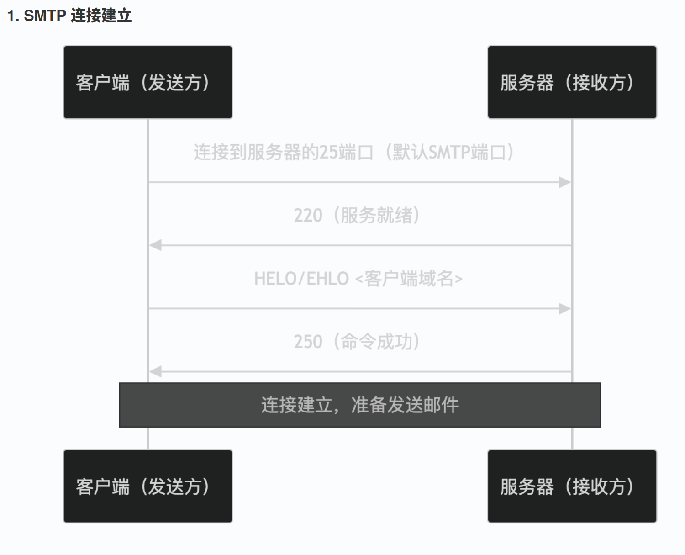
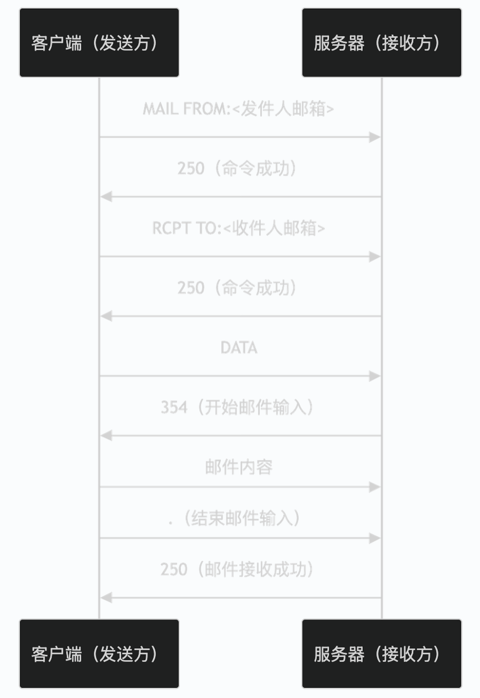

# 基于SMTP协议的邮件发送客户端

## 具体功能

基于本地的SMTP客户端向**qq邮箱的SMTP服务器**发送邮件.

额外功能:
- 使用OpenSSL进行TLS加密连接SMTP服务器.

## QQ邮箱服务器


### 一般STMP协议通信的流程
- STMP连接的建立


- 邮件发送


### qq邮箱需要的额外认证信息

在发送MAIL FROM message之前需要发送认证的相关内容，即通过认证的qq号获取SMTP服务器的授权.

具体流程参考：https://blog.csdn.net/qq_45761339/article/details/113487709

**注意：QQ邮箱的smtp服务默认是关闭的，也需要手动开启。若想发送邮件，则发件方和收件方都需开启此服务。**

## 效果展示


## 收获

- c++ 使用变量的时候都尽量初始化，使用地址、指针等也应初始化.
- CMakeLists.txt 可以用set设置变量.
- 编写基于cmake工程的build.sh时，最好在开头加上
  ```shell
  rm -rf build
  rm -rf bin
  ```
  这样确保生成的都是最新的.
  
- c++中char*、string的转换
  - string 转 char*
  ```cpp
  std::string str = "123456789";
  char *p1 = &str[0];
  char *p2 = const_cast<char *>(str.c_str());
  std::cout << p1 << "\n";
  std::cout << p2 << "\n";
  ```

  - char* 转string
  ```cpp
  char str[105] = "123142241";
  char *p = str;
  std::string s1(p); // 构造实现
  std::string s2 = p; // 赋值实现
  std::cout << s1 << "\n";
  std::cout << s2 << "\n";
  ```

- 基于CMake连接Linux下的Openssl库
  ```CMake
  find_package(OpenSSL REQUIRED)
  include_directories(${OPENSSL_INCLUDE_DIR})
  target_link_libraries(
    SMTP_client
    ${OPENSSL_LIBRARIES}
  )
  ```
  参考文章： https://www.cnblogs.com/music-liang/p/17980514